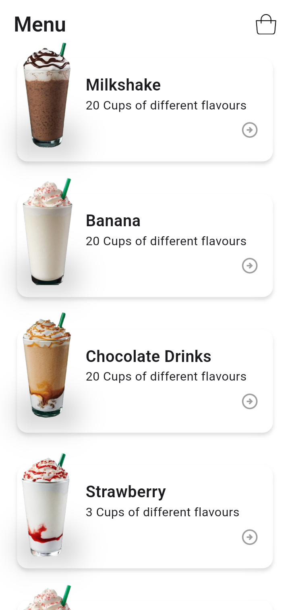
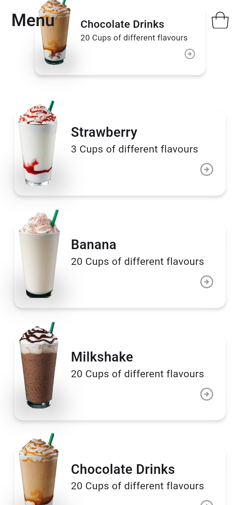
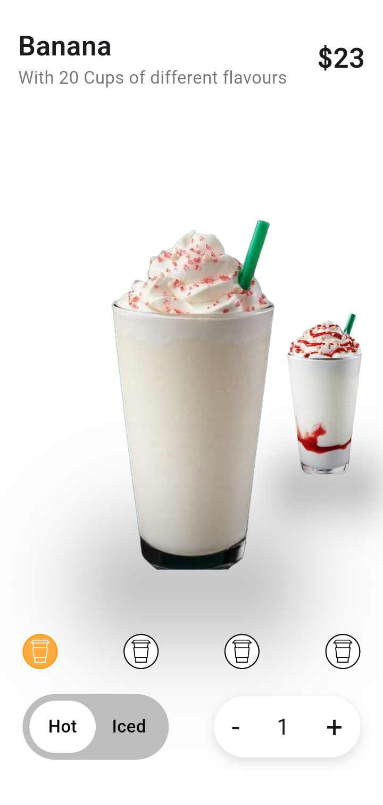
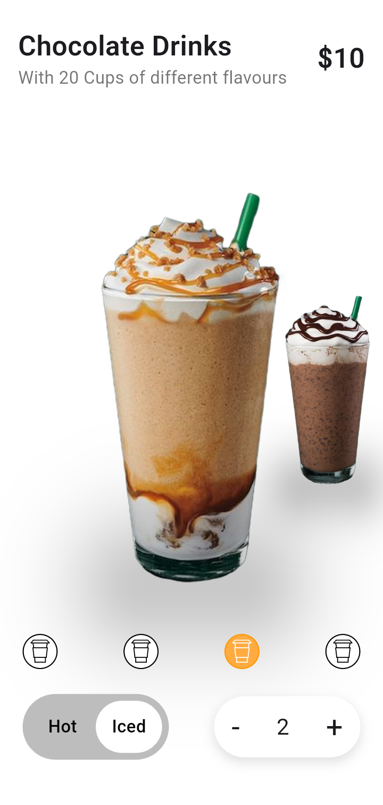

<div align="center">

# ☕ Coffee App UI Design

**An animated, cross-platform Flutter menu & product-detail experience for a coffee/drinks app.**

[](https://flutter.dev)
[](https://dart.dev)
[](#-license)
[](#)

[](https://github.com/Tarek3222/Coffie-App-UI-Design/stargazers)
[](https://github.com/Tarek3222/Coffie-App-UI-Design/commits/main)

</div>

---

## 📖 Overview

**Coffee App UI Design** is a Flutter recreation of a modern drinks/coffee ordering flow — a scrollable **Menu screen** with a scale-on-scroll list of drinks, and a **Drink detail screen** with a swipeable product carousel, hot/iced toggle, and a quantity selector.

The project is a deep dive into **custom animation and interaction design** in Flutter: scroll-driven transforms, a synchronized `PageView` carousel, and hand-built stateful controls — all without relying on animation packages. It's meant as a **UI foundation**, ready to be connected to a real menu API, cart, and checkout flow.

**Who it's for:**
- 📱 Developers looking for a reference implementation of scroll-linked and carousel animations in Flutter
- 🎨 Designers/engineers evaluating how a food & drink app concept translates into interactive Flutter widgets
- 🧑‍💻 Recruiters/reviewers looking for evidence of custom animation logic and clean stateful widget design

**Key value:** a compact codebase showing how far you can get with core Flutter APIs (`AnimatedBuilder`, `PageController`, `Transform`) before reaching for a third-party animation library.

---

## ✨ Features

- ✅ **Animated Menu List** — drink cards scale down as they scroll past, driven by `ScrollController` + `AnimatedBuilder`
- ✅ **Drink Detail Carousel** — a `PageView` with synchronized scale/translate transforms for a 3D-style card-stack effect
- ✅ **Hot / Iced Toggle** — a custom animated segmented control (`DrinkToggle`)
- ✅ **Quantity Selector** — a reusable stepper widget for adjusting order quantity
- ✅ **Data-Driven Menu** — drinks rendered from a single `DrinkModel` list, making it trivial to swap in real menu data
- ✅ **Custom Iconography** — SVG selection indicators via `flutter_svg`
- ✅ **Multi-Platform Ready** — Android, iOS, Web, Windows, macOS, and Linux targets are pre-configured

---

## 📸 Screenshots

<div align="center">

| Menu | Drink Detail | Toggle & Quantity | Carousel |
|:---:|:---:|:---:|:---:|
|  |  |  |  |

</div>

---

## 🛠 Tech Stack

| Category | Technology |
|---|---|
| **Framework** | [Flutter](https://flutter.dev) (stable channel) |
| **Language** | [Dart](https://dart.dev) `^3.11.5` |
| **UI Toolkit** | Material Design widgets |
| **Animation** | Core Flutter APIs — `AnimatedBuilder`, `PageController`, `Transform`, `AnimatedContainer` |
| **Vector Graphics** | [`flutter_svg`](https://pub.dev/packages/flutter_svg) `^2.3.0` |
| **Iconography** | `cupertino_icons`, custom SVG assets |
| **Linting** | `flutter_lints` `^6.0.0` |
| **Platforms** | Android · iOS · Web · Windows · macOS · Linux |

> **Not yet part of this project** (see [Future Improvements](#-future-improvements)): state management library, dependency injection, backend/API integration, persistent local storage/cart, and automated CI/CD. This repo currently focuses on the UI and interaction layer.

---

## 🏗 Architecture

The codebase keeps things intentionally lean, matching its current scope as an interactive UI showcase:

- **Pattern:** Presentation-only, view/widget separation — no business logic layer yet since there's no backend or cart persistence
- **State Management:** Native Flutter (`StatelessWidget` / `StatefulWidget`) — scroll position, carousel page, toggle selection, and quantity are all local widget state
- **Dependency Injection:** None required at this stage (no services to inject)
- **Networking:** Not implemented — the menu is backed by a static, in-memory `DrinkModel.drinks` list
- **Local Storage:** Not implemented — no persisted cart or order data yet
- **Error Handling:** Not yet implemented (no network/data-loading failure states exist to handle)

**Folder structure:**

```
lib/
├── main.dart               # App entry point & MaterialApp config
├── drink_model.dart         # Drink data model + static menu data
├── views/
│   ├── home_view.dart        # Scrollable menu with scale-on-scroll animation
│   └── drink_view.dart       # Drink detail carousel + ordering controls
└── widgets/
    ├── drink_card.dart        # Menu list item
    ├── drink_toggle.dart      # Hot/Iced animated toggle
    └── quantity_selector.dart # Stepper control for order quantity
```

Assets are organized by purpose (`assets/drinks`, `assets/logo`, `assets/App_images`), keeping design resources decoupled from code.

---

## 🚀 Getting Started

### Prerequisites

- [Flutter SDK](https://docs.flutter.dev/get-started/install) (stable channel, compatible with Dart `^3.11.5`)
- A configured emulator/simulator, physical device, or a Chrome/desktop target

### Installation

```bash
# Clone the repository
git clone https://github.com/Tarek3222/Coffie-App-UI-Design.git
cd Coffie-App-UI-Design

# Install dependencies
flutter pub get
```

### Run the project

```bash
# List available devices
flutter devices

# Run on a connected device/emulator
flutter run

# Or target a specific platform
flutter run -d chrome
flutter run -d windows
```

---

## 💡 Engineering Highlights

- **Scroll-linked animation without a library** — `HomeView` derives a per-item scale directly from `ScrollController.offset`, producing a smooth "focus" effect as cards scroll past, using nothing beyond core Flutter APIs.
- **Synchronized carousel transforms** — `DrinkView` combines `PageController`'s fractional page value with `Transform.translate`/`Transform.scale` to create a layered, depth-aware product carousel.
- **Data-driven UI** — the entire menu renders from a single `List<DrinkModel>`, so adding, removing, or swapping in real API data requires no changes to the view layer.
- **Small, composable stateful widgets** — `DrinkToggle` and `QuantitySelector` each own just enough local state to do their job, keeping them easy to drop into other screens.
- **Clean baseline for growth** — no premature architecture (state management, DI, networking layers) was added before there was a real need for it, keeping the animation logic easy to read and reason about.

---

## 📄 License

This project is licensed under the **MIT License**.
*(No `LICENSE` file is present yet — add one at the repo root to make this official; see [choosealicense.com](https://choosealicense.com/licenses/mit/).)*

---

## 👤 Author

**Tarek**

[](https://github.com/Tarek3222)
[](https://www.linkedin.com/in/tarek-ahmed-belal-62b238368)
[](mailto:00tarek404@gmail.com)

